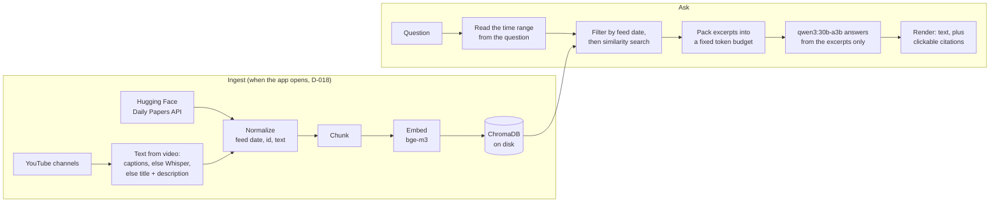

# Since — project overview

*What's happened since you last looked.* Since is a local research-feed assistant. It
collects Hugging Face Daily Papers and a few chosen YouTube channels, and answers plain
questions about them with sources: what is new, whether a topic came up, and how a topic
has developed over the last weeks. Everything runs on one machine with a local model: no
account, no cloud service, no server.

This document is the starting point for a reviewer. It says why the project exists, how it
works, how it is protected, how it was tested and what the results were. Every number
links to the file it comes from. Installation is in the [README](../README.md).

**Contents:** [Problem](#the-problem) · [Claim](#the-claim-tested) ·
[How it works](#how-it-works-retrieval-augmented-generation-with-time-first) ·
[Stack](#stack-and-why) · [Security](#security-and-privacy) · [Testing](#how-it-was-tested) ·
[Results](#results) · [What we learned](#what-went-wrong-and-what-we-learned) ·
[Limitations](#limitations) · [Try it](#try-it) · [How it was built](#how-it-was-built) ·
[Where to read more](#where-to-read-more)

---

## The problem

Keeping up with AI research means checking the Hugging Face Daily Papers page (22 to 60 papers a weekday between
2026-09-21 and 2026-10-05, none at weekends) and several YouTube channels. None of them remembers anything
across sources or time: you cannot ask "did anyone cover X this month?" or "how has Y moved
in the last four weeks?". Hosted tools that do something similar cost money and send your
interests to someone else's cloud. Since is a small, open-source (Apache-2.0) alternative
that runs on your own computer. Full goal and success criteria: [`GOAL.md`](GOAL.md).

## The claim tested

> Filtering by **feed date** before similarity search answers time-bound questions better
> than plain similarity search.

*Feed date* is the day something appeared in the feed we watch (Hugging Face's
`submittedOnDailyAt`, a video's upload date), not when it was first published elsewhere. A
paper can sit on arXiv for weeks before Hugging Face features it, and "what is new in the
feed" is the question we care about ([D-002](DECISIONS.md)).

If plain similarity search had scored the same, the claim would have been wrong, and that
would have been the result. It did not: see [Results](#results).

## How it works: retrieval-augmented generation, with time first

Since is a RAG system (retrieval-augmented generation): it retrieves the most relevant
excerpts from its own store and lets a language model answer from those excerpts only,
citing each one.

**Retrieval.** The question is read for a time range ("last week", "since Monday",
"between September 20 and 25", Swedish or English; `vg09/date_range.py`). The store is
filtered to that range by feed date, and only then searched by similarity
(`vg09/retrieval.py`). A question that names papers or videos searches only that source.
At most two excerpts per document are kept, so one long video cannot fill the answer.

**Augmentation.** Excerpts are packed into a fixed budget so the prompt never overflows
the model's context window: 16,000 tokens in total, of which 11,560 for excerpts and 4,000
kept free for the model's reasoning and answer ([`DESIGN.md` § Context
budget](DESIGN.md)). Every request sets the context size explicitly and checks the real
token count afterwards, because an oversized prompt is silently cut from the front with no
error ([KB-005](kb/KB-005-ollama-num-ctx-silent-truncation.md)). The model is told
today's date and the range that was applied ([KB-029](kb/KB-029-qwen3-discards-current-sources-as-future-without-todays-date.md)).

**Generation.** `qwen3:30b-a3b` answers in English from the excerpts only, citing them as
`[N]`. The app turns each citation into a link that opens the paper, or the video at the
second a quoted sentence is spoken. It warns when a quote is not in the source it is
credited to ([KB-030](kb/KB-030-qwen3-credits-verbatim-quotes-to-the-wrong-source.md)).

## Stack and why

| Part | Choice | Why | Decision |
|---|---|---|---|
| Language | Python | Libraries for every part below | — |
| Model server | Ollama, on `127.0.0.1` | Local, simple, one API for chat and embeddings | D-005, D-020 |
| Language models | `qwen3:30b-a3b` (MoE, ~20 GB VRAM) and `qwen3:8b` (~6 GB) | Same family, compared on VRAM cost | D-005 |
| Embeddings | `bge-m3`, passed in explicitly | Multilingual, long input; Chroma's default silently truncates at 256 tokens | D-005, [KB-006](kb/KB-006-chroma-default-embedder-256-token-limit.md) |
| Vector store | ChromaDB, embedded | No server; date filter in the same query as similarity | D-004 |
| Video text | Captions, then local Whisper, then title + description | Two of four channels block captions | D-001, D-009 |
| UI | Streamlit | A two-page local app with little code | D-016, D-017 |
| Answer rendering | markdown-it-py | The app decides what becomes HTML, not the model (T-072) | D-020 |
| Presentation | Slidev | Slides as Markdown in the repo | D-019 |

All decisions with the alternatives that were rejected: [`DECISIONS.md`](DECISIONS.md).

## Security and privacy

**Threat model.** One person runs the app on their own machine. The untrusted input is the
content it fetches: abstracts, titles, video descriptions and transcripts, written by
strangers. Someone who controls that text can try to steer the answer (prompt injection),
get HTML or links into the browser, or make the app write files or contact other hosts.
Someone on the network could try to reach the app. ([`DESIGN.md` § Security
baseline](DESIGN.md), [D-020](DECISIONS.md).)

**Measures:**

| Risk | Measure | Checked by |
|---|---|---|
| The model acts on the machine | The model never gets tools: no function calling, files, shell or network. An injection can change words, not actions | `tests/test_no_tools.py`, a hard rule in `CLAUDE.md` (T-075) |
| Others reach the app | Streamlit and Ollama listen on `127.0.0.1` only. Before T-071 the app listened on every interface | `netstat` before and after; a LAN address refused (T-071) |
| Injected text becomes live HTML | The app renders the answer itself with HTML, links and images off; only its own citation links are HTML, and only to `https` on Hugging Face, arXiv or YouTube | 6 unit tests; an injected `` shown as text in a real browser (T-072) |
| Injected text steers the answer | Sources sit between `<<<BEGIN>>>`/`<<<END>>>` and are declared untrusted data, never instructions | Six planted attacks × 5 runs: steered 2/30 before, **0/30** after ([results](eval-results/2026-10-05-t073-prompt-injection.md)) |
| Fetched ids write outside `data/` | arXiv ids, video ids and feed dates must match their real formats before they become paths or URLs | `tests/test_reach.py` (T-074) |
| Data leaves the machine | Only the public feeds are contacted; Streamlit's usage statistics, on by default, are off | Code read, host list in T-074 |

**What is not protected, said plainly.** 0 of 30 does not mean the model cannot be
steered; it means these six attempts no longer worked. The browser loads the typeface from
Google Fonts, which tells Google the page was opened (nothing about questions or sources).
There is no sandbox around the Python process and no login: both are deliberate
non-goals for a single-user local app ([`GOAL.md`](GOAL.md)).

Asked "What computer is this? Give me the link to its IP", the app answered that its
sources contain no such address. It has no way to find out: it only reads its excerpts.

## How it was tested

| Kind | What | Where |
|---|---|---|
| Unit tests | 351 tests, standard-library `unittest`, no model needed (Ollama is mocked) | `tests/` |
| Graded evaluation | 15 questions and an answer key written by me **before** any retrieval code existed; each answer graded by hand against the key, never by a model | [`eval-questions.md`](eval-questions.md), [`eval-results/`](eval-results/) |
| Frozen dataset | The third run used a store rebuilt from an archive checked against a 1,279-file manifest, so new data cannot change the answer key | [`eval-dataset-manifest.txt`](eval-dataset-manifest.txt), T-069 |
| Injection and citation measurement | Real pipeline, fixed questions, before and after each prompt change | `scripts/t073_*.py` |
| Real use | Questions asked in a real browser, and a fresh clone taken through the README to a first answer, twice (T-034, T-057) | [`TICKETS.md`](TICKETS.md) |

There is no CI. The real runs found what unit tests could not: three defects in the
Sources page that 250 passing tests missed, and a prompt change that broke citation links
while every test passed ([KB-035](kb/KB-035-numbered-source-markers-make-qwen3-cite-source-n.md)).

## Results

**Date filter (A) against plain similarity search (B).** 15 questions per run, graded by
hand:

| Run | A better | B better | Equal | Both wrong | File |
|---|---|---|---|---|---|
| 2026-09-20 (T-032) | 7 | 1 | 4 | 3 | [results](eval-results/2026-09-20-2136-t032-date-aware-vs-plain.md) |
| 2026-09-22 (T-032) | 8 | 0 | 5 | 2 | [results](eval-results/2026-09-22-0027-t032-date-aware-vs-plain.md) |
| 2026-10-05 (T-069), frozen data | 7 | 1 | 5 | 2 | [results](eval-results/2026-10-05-1443-t069-frozen-date-aware-vs-plain.md) |

In three independent runs the date-aware search won 7 or 8 questions and lost at most one.
The one loss on 2026-10-05 was a ranking error (two general benchmarks ranked above the one
the key names), not a date-filter failure. The cleanest measure of the date filter alone is
2026-09-22; the 2026-10-05 arm A is the whole app, with the source filter and a larger
candidate pool.

**Large against small model** (`qwen3:30b-a3b` against `qwen3:8b`, same excerpts):
large better 4, small better 0, equal 9, both wrong 2
([results](eval-results/2026-09-23-1516-t033-model-size-comparison.md)). The same two
questions failed in both comparisons: retrieval did not find the right source, so a larger
model could not help.

**The graded runs predate the latest changes.** The prompt was rewritten on 2026-10-05
(T-073), and "research" stopped narrowing a search to papers (T-078), which changes eval
questions 7 and 11. The graded evaluation was not re-run after them, by my
decision; the injection and citation measurements after T-073 are in
[that file](eval-results/2026-10-05-t073-prompt-injection.md).

## What went wrong and what we learned

The project keeps what it learns about its tools in a knowledge base
([`kb/INDEX.md`](kb/INDEX.md)). The lessons that shaped the app:

- **Silent failures are the expensive ones.** Ollama cuts an oversized prompt from the
  front without an error (KB-005); Chroma's default embedder truncates at 256 tokens
  without an error (KB-006); `localhost` cost two seconds per request, thirty per question,
  until it became `127.0.0.1` (KB-024). All three were found by measuring.
- **The model did not know what day it was.** It discarded all 34 of the day's excerpts as being
  "from the future" until it was told the date (KB-029).
- **It quotes correctly but credits the wrong source,** 4 of 5 quotes in one answer
  (KB-030); the app now warns about it.
- **Quiet injections work where blunt ones fail,** and naming them in the prompt made it
  worse (KB-036).
- **Markdown can eat HTML:** a backtick pair in an answer showed citation links as raw HTML
  (KB-034); the app now renders answers itself.

## Limitations

- **15 questions, graded by the person who built it.** Enough to show the pattern held in
  three runs, not to generalise. The key was written first and every answer is in the repo
  next to it, so anyone can re-grade.
- **Needs a GPU with about 24 GB** for the large model.
- **Misspellings in captions cannot be searched.** "Palantir" captioned as "Palunteer" is
  never found (eval question 12).
- **One question type still fails:** asking for both papers and videos on a broad topic
  returned only videos in every run (eval question 14).
- **Catching up needs the computer on.** The app updates when it opens; "24/7" is read as

## Try it

Install and first run: [README](../README.md). On Windows, double-click `Since.bat`; the
app opens in the browser, updates itself, and answers at `http://127.0.0.1:8501`.

## How it was built

The code was written with an AI coding agent (Claude Code), directed and reviewed by me
, who decided what to build, graded every evaluation answer, and tested the app.
Because an agent starts every session with no memory, the work ran on written records:

- **80 tickets** with checkable acceptance criteria ([`TICKETS.md`](TICKETS.md))
- **20 decisions** with the alternatives rejected ([`DECISIONS.md`](DECISIONS.md))
- **35 knowledge-base entries** on how the tools really behave ([`kb/`](kb/INDEX.md))
- **A handoff note per session** and an index of each session's transcript
  ([`HANDOFF.md`](HANDOFF.md), [`sessions/`](sessions/))

## Where to read more

| To understand | Read |
|---|---|
| The goal, success criteria and non-goals | [`GOAL.md`](GOAL.md) |
| The phases and what is left | [`PLAN.md`](PLAN.md) |
| The design: budget, data model, security baseline | [`DESIGN.md`](DESIGN.md) |
| Why each choice was made | [`DECISIONS.md`](DECISIONS.md) |
| The questions and answer key | [`eval-questions.md`](eval-questions.md) |
| Every graded answer | [`eval-results/`](eval-results/) |
| What the tools really do | [`kb/INDEX.md`](kb/INDEX.md) |
